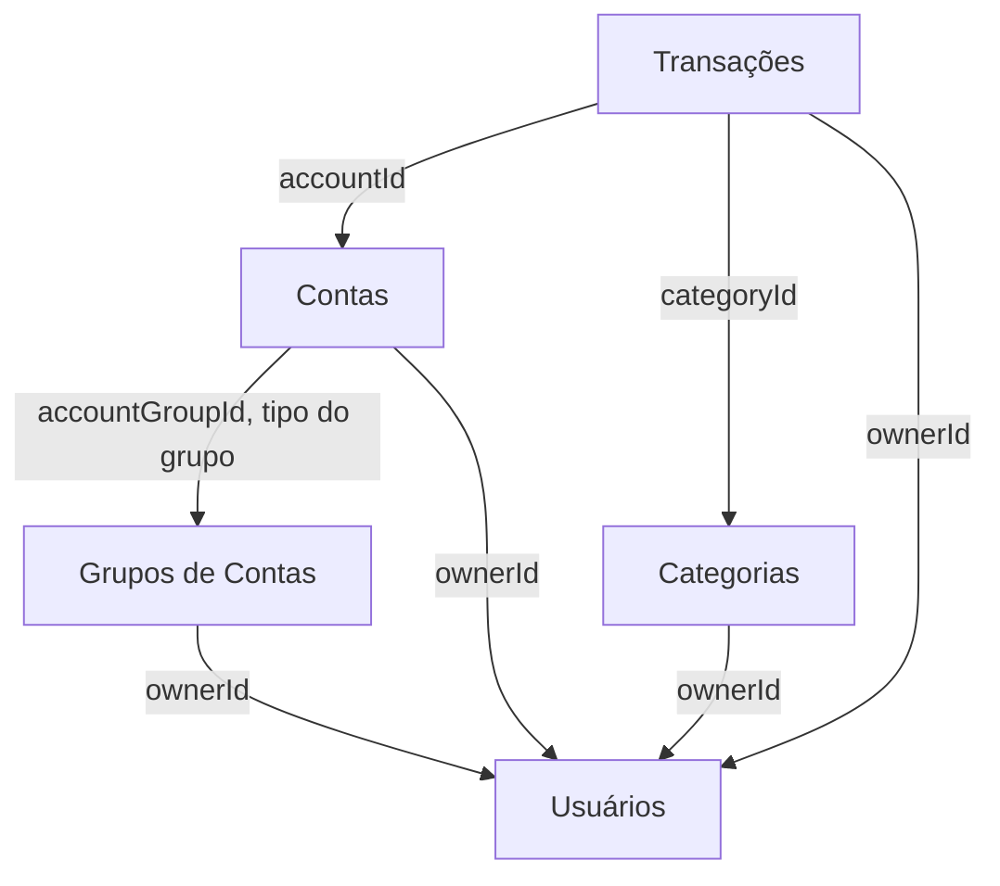

# Domínios

Um arquivo por contexto de `server/src/domain`, com o mapa técnico da fatia: os arquivos que a compõem, as regras que cada um garante, as fronteiras com os vizinhos e o que ainda não existe.

Estes documentos descrevem **o que está construído**. O que o produto **deve** fazer está em [`../requirements.md`](../requirements.md), e o que ainda não foi decidido em [`../open-decisions.md`](../open-decisions.md). Quando os dois divergem, o documento do domínio registra a divergência e aponta a RN contrariada — é um bug, não uma regra.

O que vale para o repositório inteiro não é repetido aqui: a arquitetura transversal — camadas, blocos de `core/`, módulos e injeção, ciclo da requisição e contrato de erro, persistência, segurança, configuração — está em [`../architecture/`](../architecture/README.md); stack, ambiente, comandos e convenções de nomenclatura estão em [`../../server/CLAUDE.md`](../../server/CLAUDE.md).

A manutenção destes arquivos é da skill `domain-architect`: contexto novo em `src/domain/` nasce com o seu documento e com a sua linha nesta tabela.

## Implementados

| Domínio | Contexto | Requisitos | Estado |
| ------- | -------- | ---------- | ------ |
| [Usuários](user.md) | `src/domain/user` | RF001, RF002 · RN001–RN014, RN049 | Cadastro, login, renovação e encerramento de sessão, consulta e edição de perfil, preferência de situação padrão de transação (RN049). Faltam alteração de senha (RN009) e exclusão lógica (RN012, RN013) |
| [Grupos de Contas](account-group.md) | `src/domain/account-group` | RF003 · RN015–RN017 | Cadastro, listagem com filtro por tipo e consulta individual. Faltam edição e exclusão bloqueada por contas (RN017) |
| [Contas](account.md) | `src/domain/account` | RF004 · RN018–RN025 | Cadastro nos dois tipos de grupo e listagem com saldo e limite. Faltam consulta individual, edição e arquivamento (RN024, RN025); saldo e limite dependem de _Transações_ e _Faturas_ |
| [Categorias](category.md) | `src/domain/category` | RF006 · RN029–RN035 | Só o cadastro raiz. Faltam hierarquia de subcategorias (RN031–RN033), consulta, listagem em árvore, edição e arquivamento (RN034, RN035) |
| [Transações](transaction.md) | `src/domain/transaction` | RF008 · RN039–RN043, RN048, RN049 | Registro de receita e despesa, com derivação automática da situação (RN049). Falta transferência (RN043–RN047), efetivar/reverter a situação depois de criada, consulta, edição e exclusão |

`src/domain/example` (entidade `Note`) não é domínio real: é a fatia vertical de referência para criar um contexto novo, e sai quando deixar de ser útil.

## Como os contextos se ligam hoje

As setas apontam para quem é conhecido. _Usuários_ não conhece ninguém; _Contas_ e _Transações_ são os únicos que hoje leem outro domínio dentro de um caso de uso (`CreateAccountUseCase` injeta o `AccountGroupsRepository` para descobrir o tipo do grupo; `CreateTransactionUseCase` injeta `AccountsRepository`, `CategoriesRepository` e `UsersRepository` — esta última para ler a preferência de situação padrão, RN049 — para checar dono, arquivamento, compatibilidade de natureza e o padrão de situação).

## Ainda sem contexto no código

Previstos nos requisitos e sem nenhuma linha escrita — cada um ganha o seu arquivo quando `src/domain/<contexto>` nascer:

Cartões de Débito (RF005) · Tags (RF007) · Faturas (RF009) · Orçamentos (RF010) · Metas (RF011) · Lançamentos Favoritos (RF012) · Anexos (RF013) · Relatórios (RF014) · Notificações (RF015)

_Faturas_ é a dependência que ainda trava o limite disponível dos cartões (RN023). O saldo real das contas (RN021) depende agora só de _Transações_ passar a compor o saldo por situação (RN050) — a derivação da situação em si (RN049) já existe desde a SCRUM-54.
